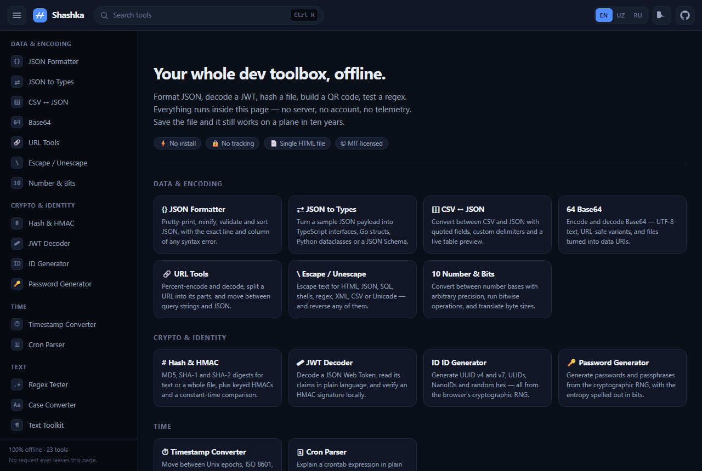
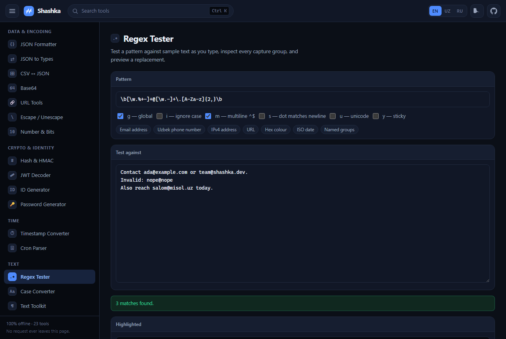
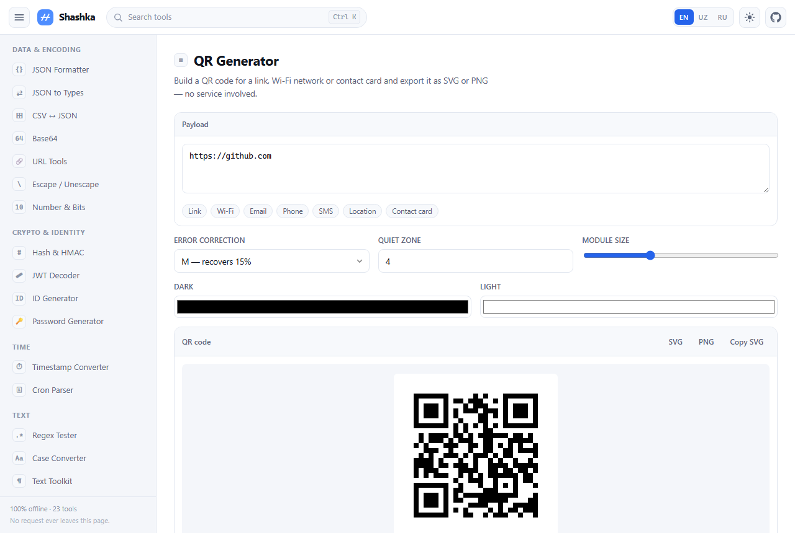

<div align="center">

# Shashka

**23 developer tools in a single HTML file.**
No install, no build step, no accounts, no network. Ever.

[](LICENSE)
[](package.json)
[](#why-this-exists)
[](dist/shashka.html)



</div>

---

## Why this exists

Every developer needs to format some JSON, decode a JWT, check a hash, or test a regular
expression several times a week. The usual answer is to search for an online tool and paste
the data into a stranger's server.

That data is often a production token, a customer record, or a private key.

Shashka does the same jobs, but every byte stays in your browser. There is no backend to
send anything to — open the network tab and watch it stay empty. Download
[`dist/shashka.html`](dist/shashka.html), put it on a USB stick, and it will still work on an
air-gapped laptop in ten years.

| | |
|---|---|
| **Zero network** | No fetch, no XHR, no CDN, no fonts, no analytics. Nothing to leak. |
| **Zero install** | One file. Double-click it. Works from `file://`. |
| **Zero dependencies** | No npm packages, no framework, no build required to develop. |
| **Trilingual** | Interface in English, Oʻzbekcha and Русский. |
| **Keyboard first** | `Ctrl`+`K` or `/` opens the command palette. |
| **Light and dark** | Follows your system, and remembers if you override it. |

## Get it

**Download one file** — grab [`dist/shashka.html`](dist/shashka.html), open it. Done.

**Host it** — drop that same file anywhere static: GitHub Pages, S3, an intranet share.

**Run from source** — no build step needed:

```bash
git clone https://github.com/nasafuriy/offline-devtools.git
cd offline-devtools
open index.html          # or: npm run dev  →  http://localhost:5599
```

## The tools

### Data & encoding
| Tool | What it does |
|---|---|
| **JSON Formatter** | Pretty-print, minify, validate and sort keys, with the exact line and column of any syntax error, plus a collapsible tree view. |
| **JSON to Types** | Turn a sample payload into TypeScript interfaces, Go structs, Python dataclasses or a JSON Schema. |
| **CSV ↔ JSON** | RFC 4180 parsing — quoted fields, embedded newlines, delimiter auto-detection, live table preview. |
| **Base64** | UTF-8 text, URL-safe alphabet, files to data URIs, and data URIs back to files. |
| **URL Tools** | Percent-encode and decode, split a URL into its parts, convert query strings to JSON. |
| **Escape / Unescape** | HTML, JSON, SQL, POSIX shell, PowerShell, regex, XML, CSV and Unicode — both directions. |
| **Number & Bits** | Arbitrary-precision base conversion (2–36), bitwise operations at 8/16/32/64-bit widths, byte sizes. |

### Crypto & identity
| Tool | What it does |
|---|---|
| **Hash & HMAC** | MD5, SHA-1, SHA-256/384/512 for text or a whole file, keyed HMACs, and checksum comparison. |
| **JWT Decoder** | Read the header and claims in plain language, see expiry as real dates, verify HS256/384/512 signatures locally. |
| **ID Generator** | UUID v4 and v7, ULID, NanoID and random hex — plus an inspector that pulls the timestamp back out. |
| **Password Generator** | Passwords and passphrases from the cryptographic RNG, with entropy in bits and an honest crack-time estimate. |

### Time
| Tool | What it does |
|---|---|
| **Timestamp Converter** | Unix seconds, milliseconds, microseconds, ISO 8601, ten time zones, ISO week numbers, durations. |
| **Cron Parser** | Explains a crontab line in plain English and lists the next ten times it will actually fire. |

### Text
| Tool | What it does |
|---|---|
| **Regex Tester** | Live matching, every capture group in a table, named groups, replacement preview and a cheat sheet. |
| **Case Converter** | Thirteen conventions at once — camelCase, snake_case, kebab-case, Title Case and the rest. |
| **Text Toolkit** | Sort, deduplicate, shuffle, trim, number, wrap and slugify lines; find-and-replace; live statistics. |
| **Text Diff** | Myers diff with inline, side-by-side and unified-patch views. |
| **Markdown Preview** | Live rendering with an editor toolbar, exportable as standalone HTML. |
| **Fake Data** | Lorem ipsum plus believable fake records as JSON, CSV, SQL `INSERT`s or plain lines. |

### Visual
| Tool | What it does |
|---|---|
| **Colour Tools** | HEX, RGB, HSL, HSV, CMYK, WCAG contrast checking, and generated tints, shades and harmonies. |
| **QR Generator** | A complete ISO/IEC 18004 encoder — versions 1–40, all masks — with Wi-Fi, vCard and geo presets. Exports SVG and PNG. |
| **Image Converter** | Resize, compress and convert between PNG, JPEG and WebP entirely on the canvas. |

### Reference
| Tool | What it does |
|---|---|
| **HTTP & MIME Reference** | Searchable tables of status codes, methods, security headers, common ports and MIME types. |

<div align="center">


</div>

## How it is built

Plain JavaScript, no framework. Every tool is one file that registers itself:

```js
DevBox.register({
  id: 'reverse',
  icon: '↔',
  category: 'text',
  keywords: 'reverse flip backwards',
  name: { en: 'Reverse', uz: 'Teskari', ru: 'Наоборот' },
  desc: { en: 'Reverses text.', uz: 'Matnni teskari qiladi.', ru: 'Переворачивает текст.' },

  mount(root, ctx) {
    const out = DevBox.ui.output({ title: 'Result' });
    const input = DevBox.ui.textarea({
      oninput: () => out.set([...input.value].reverse().join(''))
    });
    root.appendChild(DevBox.ui.card('Input', input));
    root.appendChild(out);
  }
});
```

Add a `<script>` line to `index.html` and it appears in the sidebar, the home page,
the command palette and the router. That is the whole extension model.

```
index.html          the shell — every script tag lives here
src/
  styles.css        one stylesheet, CSS custom properties for theming
  core.js           registry, router, command palette, i18n, theming
  lib/
    util.js         DOM helpers and the `DevBox.ui` toolkit every tool uses
    md5.js          MD5, because Web Crypto deliberately omits it
    qrcode.js       QR encoder: Reed-Solomon, masking, penalty scoring
    diff.js         Myers O(ND) line diff
    markdown.js     escape-first Markdown renderer
  tools/            one file per tool
build.mjs           inlines everything into dist/shashka.html
test/run.js         library unit tests
test/smoke.mjs      mounts every tool in real Chromium
```

## Development

```bash
npm test            # 44 unit tests: MD5 vectors, QR round-trip, diff, Markdown
npm run build       # produce dist/shashka.html
npm run dev         # static server on :5599

node test/smoke.mjs          # mount every tool in headless Chrome
node test/smoke.mjs --dist   # same checks against the built single file
```

The QR encoder is verified by a **separately written decoder** in the test suite: the tests
read the format bits back out of the rendered matrix, undo the mask, walk the zigzag,
de-interleave the blocks and check the payload survives — across four error-correction
levels, multiple versions and every mask pattern.

## Security posture

- The Markdown renderer escapes all input **before** any markup is produced, filters
  `javascript:` and `data:` URLs, and the preview strips `on*` attributes as a second layer.
- Nothing is transmitted. Inputs persist only in your own `localStorage`, and only so the
  page remembers what you were doing.
- The password generator uses rejection sampling on `crypto.getRandomValues`, so there is
  no modulo bias.
- MD5 and SHA-1 are included because legacy checksums need them, and both are labelled as
  unfit for security.

## Contributing

New tools are very welcome — see [CONTRIBUTING.md](CONTRIBUTING.md). The bar is simple:
no dependencies, no network, works from `file://`, and ships all three translations.

---

<details>
<summary><b>Oʻzbekcha</b></summary>

**Shashka** — bitta HTML faylga jamlangan 23 ta dasturchi vositasi. Oʻrnatish shart emas,
internet kerak emas, hech qanday maʼlumot brauzeringizdan chiqmaydi.

JSON formatlash, JWT ochish, xesh hisoblash, QR kod yasash, regex sinash, cron ifodasini
tushuntirish, rangni oʻgirish, rasm siqish va boshqalar. Odatda bunday ishlar uchun
begona saytga token yoki mijoz maʼlumotini joylashtiriladi — bu yerda esa hammasi shu
sahifa ichida bajariladi.

[`dist/shashka.html`](dist/shashka.html) faylini yuklab oling va ochavering. Tayyor.
Interfeys oʻzbek, ingliz va rus tillarida.

</details>

<details>
<summary><b>По-русски</b></summary>

**Shashka** — 23 инструмента разработчика в одном HTML-файле. Без установки, без интернета,
без отправки данных куда-либо.

Форматирование JSON, разбор JWT, хеши, QR-коды, тестирование регулярок, объяснение
cron-выражений, работа с цветом, сжатие изображений и другое. Обычно для таких задач
приходится вставлять токен или данные клиента на чужой сайт — здесь всё выполняется
внутри страницы.

Скачайте [`dist/shashka.html`](dist/shashka.html) и откройте. Всё.
Интерфейс на русском, английском и узбекском.

</details>

## Licence

[MIT](LICENSE) — use it, fork it, ship it inside your own product. No attribution required,
though a star is always welcome.
